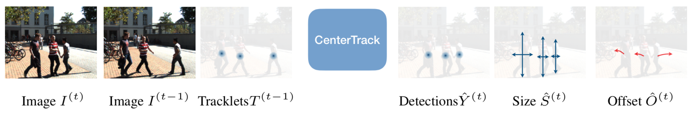

## Introduction      
This is a test of CenterTrack on face detection. More theory details can be found in author's github page:
https://github.com/xingyizhou/CenterTrack

> [**Tracking Objects as Points**](http://arxiv.org/abs/2004.01177)

## Result on Foule.mp4:

https://drive.google.com/open?id=1sdkbb2BLlLpOeaSwCtROsiyqb853kNt4

# Tracking Objects as Points
Simultaneous object detection and tracking using center points:

## Abstract
Tracking has traditionally been the art of following interest points through space and time. This changed with the rise of powerful deep networks. Nowadays, tracking is dominated by pipelines that perform object detection followed by temporal association, also known as tracking-by-detection. In this paper, we present a simultaneous detection and tracking algorithm that is simpler, faster, and more accurate than the state of the art.

## Installation

Please refer to [INSTALL.md](readme/INSTALL.md) for installation instructions.

Notice that you must have `Pytorch <= 1.4.0` to compile `DCNv2`, otherwise you might have some problems.

I used Ubuntu 20.04, Cuda 10.2, Pytorch = 1.4+Cuda10.0, torchvision = 0.5+Cuda10.0 to succesfully run the test. Pytorch 1.5.0 didn't work for me.

Also if your gcc and g++ version is too new you'll need to downgrade it, with gcc-7 and g++-7 it'll work.

## Use CenterTrack

CenterTrack support demo for videos, webcam, and image folders. 

First, download the models. By default, [coco_tracking](https://drive.google.com/open?id=1tJCEJmdtYIh8VuN8CClGNws3YO7QGd40) for 80-category detection, which works best for face detection. You can also download other models from the [Model zoo](readme/MODEL_ZOO.md) and put them in `CenterNet_ROOT/models/`.

To test face detection and tracking on the video, run

~~~
python demo.py tracking --load_model ../models/coco_tracking.pth --demo /path/to/image/or/folder/or/video  --save_video
~~~

For webcam demo, run     

~~~
python demo.py tracking --load_model ../models/coco_tracking.pth --demo webcam 
~~~

You can add `--debug 2` to visualize the heatmap and offset predictions.

To use this CenterTrack in your own project, you can 

~~~
import sys
CENTERTRACK_PATH = /path/to/CenterTrack/src/lib/
sys.path.insert(0, CENTERTRACK_PATH)

from detector import Detector
from opts import opts

MODEL_PATH = /path/to/model
TASK = 'tracking' # or 'tracking,multi_pose' for pose tracking and 'tracking,ddd' for monocular 3d tracking
opt = opts().init('{} --load_model {}'.format(TASK, MODEL_PATH).split(' '))
detector = Detector(opt)

images = ['''image read from open cv or from a video''']
for img in images:
  ret = detector.run(img)['results']
~~~
Each `ret` will be a list dict: `[{'bbox': [x1, y1, x2, y2], 'tracking_id': id, ...}]`

## Training on custom dataset

If you want to train CenterTrack on your own dataset, you can use `--dataset custom` and manually specify the annotation file, image path, input resolutions, and number of categories. You still need to create the annotation files in COCO format (referring to the many `convert_X_to_coco.py` examples in `tools`). For example, you can use the following command to train on our [mot17 experiment](experiments/mot17_half_sc.sh) without using the pre-defined mot dataset file:

~~~
python main.py tracking --exp_id mot17_half_sc --dataset custom --custom_dataset_ann_path ../data/mot17/annotations/train_half.json --custom_dataset_img_path ../data/mot17/train/ --input_h 544 --input_w 960 --num_classes 1 --pre_hm --ltrb_amodal --same_aug --hm_disturb 0.05 --lost_disturb 0.4 --fp_disturb 0.1 --gpus 0,1

~~~

## Benchmark Evaluation and Training

After [installation](readme/INSTALL.md), follow the instructions in [DATA.md](readme/DATA.md) to setup the datasets. Then check [GETTING_STARTED.md](readme/GETTING_STARTED.md) to reproduce the results in the paper.
We provide scripts for all the experiments in the [experiments](experiments) folder.

## License

CenterTrack is developed upon [CenterNet](https://github.com/xingyizhou/CenterNet). Both codebases are released under MIT License themselves. Some code of CenterNet are from third-parties with different licenses, please check the CenterNet repo for details. In addition, this repo uses [py-motmetrics](https://github.com/cheind/py-motmetrics) for MOT evaluation and [nuscenes-devkit](https://github.com/nutonomy/nuscenes-devkit) for nuScenes evaluation and preprocessing. See [NOTICE](NOTICE) for detail. Please note the licenses of each dataset. Most of the datasets we used in this project are under non-commercial licenses.

