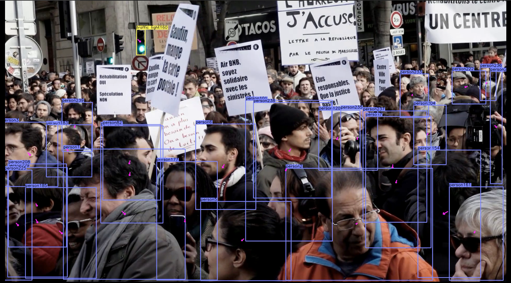

# High performance Face Detection and Tracking in real time 
In this project, we test and compare different face detection algorithms on images and videos, and we have done lots of research to combine different algorithms together to get best performance on our mission, where hundreds of faces appear in the video and need to be detected and tracked.
The environment required is 
````
numpy
tensorflow>=1.12.1
opencv-python
opencv-contrib-python
keras
matplotlib
pillow
TensorRT
````
More details can be found in the corresponding branches.

## Prerequisites

Development for this project will be isolated in Python virtual environment. This allows us to experiment with different versions of dependencies.

There are many ways to install `virtual environment (virtualenv)`, see the [Python Virtual Environments: A Primer](https://realpython.com/python-virtual-environments-a-primer/) guide for different platforms, but here are a couple:

First clone this project
```
$ git clone https://github.com/ProjetECM-S8/Face-detection
```
- For Ubuntu
```bash
$ pip install virtualenv
```

- For Mac
```bash
$ pip install --upgrade virtualenv
```

Create a Python 3.6 virtual environment for this project and activate the virtualenv:
```bash
$ virtualenv -p python3.6 project
$ source ./project/bin/activate
```

Next, install the dependencies for the this project:
```bash
$ pip install -r requirements.txt
```

## CenterFace face detection and KCF face tracking pipeline

This project implements CenterFace, a high-performance and small neural network architecture designed specifically for face detection. Once CenterFace detects image, the tracker KCF is activated to track the trajectory of face movement.

The CenterFace architecture is implemented in the file `centerface.py`. Its model required is stocked in `Center_Face\models\onnx\centerface.onnx`


### Pipeline

1. Run detector, get boxes (Green)
2. Track boxes for each frame (Blue)
3. Update detector periodically or on-demand, and re-create trackers for each box. 

### Usage
Change Directory to `Center_face`

````
python tracking_centerface.py
````

Optionally use `-i` argument to set different detection intervals, in seconds. Default=6.

````
python tracking_centerface.py -i 3
````

The program also saves the faces detected and tracked in txt format in the `Output` directory. Each txt  file contains the face boxes `[No.Face, x,y,width,height]` in a frame.

To read and to load the boxes saved in the txt files in the original video

```
python read_result.py
```


## Pipeline of face detector and tracker based on Haar Cascade and KCF filters.
Detect and track faces from a webcam (required). 

We can lower detector requirements for real-time applications by heuristically or adaptively using tracking after we've obtained an initial set of bounding boxes from detection. 

Many modern deep learning detectors can be computationally expensive, and often times there is a tradeoff between precision and performance. Some of them rely on region proposal - this can result in detectors to be "jumpy" and appear to be unstable. 

For face detection in front of a webcam, we can run detector periodically, as the object of interest doesn't change semantically (still the same face), and then follow the trajectory of the face as it moves across the screen using trackers. 

In this demo, we use Blue and Green colored boxes to demonstrate detection / tracking to get a smooth trajectory of the bounding box as my face moves across the screen. 

Green = Detected face 

Blue = Box from previous detection, updated via tracking. 


### Pipeline

1. Run detector, get boxes (Green)
2. Track boxes for each frame (Blue)
3. Update detector periodically or on-demand, and re-create trackers for each box. 

### Usage
Change Directory to `face_tracking`
Run main program, you should see webcam screen, with Green or Blue box for faces detected. 

Green = Detected face 

Blue = Box from previous detection, updated via tracking. 

````
python face_tracking.py`
````

Optionally use `-i` argument to set different detection intervals, in seconds. Default=6.

````
python face_tracking.py -i 3
````


## YoloFace

The YOLOv3 (You Only Look Once) is a state-of-the-art, performant, real-time object detection algorithm based on CNN. The published model recognizes 80 different objects in images and videos. The model can be adapted to detect specifically human face. The implementation is based on the work by sthanhng [GitHub link](https://github.com/sthanhng/yoloface)

### Usage
* Change directory to `Yoloface` 

* For face detection, you should download the pre-trained YOLOv3 weights file which trained on the [WIDER FACE: A Face Detection Benchmark](http://mmlab.ie.cuhk.edu.hk/projects/WIDERFace/index.html) dataset from this [link](https://drive.google.com/file/d/1xYasjU52whXMLT5MtF7RCPQkV66993oR/view?usp=sharing) and place it in the `model-weights/` directory.

* Run the following command:

>**image input**
```bash
$ python yoloface.py --image samples/outside_000001.jpg --output-dir outputs/
```

>**video input**
```bash
$ python yoloface.py --video samples/subway.mp4 --output-dir outputs/
```

>**webcam**
```bash
$ python yoloface.py --src 1 --output-dir outputs/
```
## CenterTrack

### Introduction  

This is a test of CenterTrack on face detection and tracking.

> [**Tracking Objects as Points**](http://arxiv.org/abs/2004.01177)

### Result on Foule.mp4:

https://drive.google.com/open?id=1sdkbb2BLlLpOeaSwCtROsiyqb853kNt4



Change to `CenterTrack` folder to find instruciton and more details.

## CenterFace + Deep sort
We use CenterFace as dector and Deep sort for tracking. 
### Usage
1. Download CenterFace [model](https://github.com/ProjetECM-S8/Face-detection/tree/master/Center_Face/models) and this repository from [Drive](https://drive.google.com/drive/folders/1bBL6z1LoTdSdxuZ1p3dlKWD1AKDO_Xbm?usp=sharing)

2. Download deepsort parameters ckpt.t7
```bash
cd deep_sort/deep/checkpoint
# download ckpt.t7 from
https://drive.google.com/drive/folders/1xhG0kRH1EX5B9_Iz8gQJb7UNnn_riXi6 to this folder
cd ../../../
```
3. Run demo
```bash
python centerface_deepsort.py [VIDEO_PATH]
```
4. Read and load the boxes saved in the txt files in the original video
```bash
python read_result.py
```

